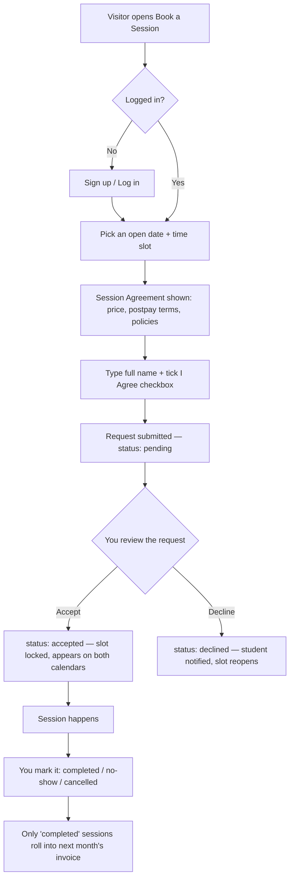
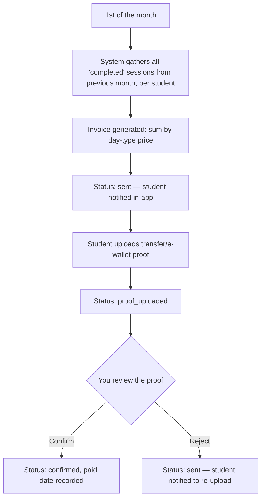

# Refa Learn — Website Implementation Plan

*"Bridging Borders, Embracing The World!"*

This is the master plan for the Refa Learn company profile + booking website. It's written to be read by you (the founder), and it's the source of truth that `agent.md` (the build instructions for your coding agent) points back to for every business rule.

---

## 1. Project Snapshot

| | |
|---|---|
| **Business name** | Refa Learn |
| **Slogan** | Bridging Borders, Embracing The World! |
| **Founder** | You — independent private English tutor, also currently a Ruangguru tutor |
| **Offering** | 1-on-1 private English sessions (90 min) + downloadable exam-prep materials |
| **Primary audience** | Indonesian students & parents — SMA students, university students, IELTS/TOEFL candidates, general learners |
| **Core differentiator** | Pay-after-class — no prepayment, billed once monthly, in arrears |
| **Chat** | Custom real-time chat built into the site |
| **Payments** | Manual: bank/e-wallet transfer + proof upload, confirmed by you |
| **Hosting** | You'll arrange domain + hosting |

---

## 2. Goals & Success Criteria

1. Turn visitors into booked sessions and material sales without you manually coordinating every step over chat.
2. Make the postpay policy the headline trust signal — it should be impossible to miss on the homepage and in the booking flow.
3. Give you **one dashboard** to run the whole operation: schedule, requests, invoices, payment review, content, and chat — no juggling spreadsheets + WhatsApp + Google Calendar.
4. Look distinctly hand-crafted and personal, not like a generic tutoring template — this is part of why the sketchbook aesthetic matters, not just decoration.
5. Be usable entirely from a phone, since most parents and students will browse and book on mobile.

---

## 3. Brand & Design Direction

### 3.1 Guiding principle
Sketchbook/hand-drawn is a real, current design trend, but the failure mode is obvious: hand-lettering everywhere kills readability, especially on a page showing prices and a contract. The right pattern (confirmed by current examples in the space) is **a clean, readable grid with hand-drawn elements used functionally** — icons, dividers, underlines, borders, circles/highlights around key numbers — rather than hand-drawn body text.

**Do:**
- Use sketchy/line-art icons for subjects (IELTS, TOEFL, calendar, chat bubble, book).
- Use a hand-drawn underline or circle to highlight the price or the "pay after class" badge.
- Use torn-paper or notebook-edge textures sparingly as section dividers.
- Keep body text and all form/contract text in a clean, highly legible sans-serif.

**Don't:**
- Don't set paragraphs of contract text or pricing tables in a script font — it must be unambiguous.
- Don't let texture/paper backgrounds reduce contrast on text.
- Don't hand-draw functional UI elements (buttons, calendar grid, form inputs) to the point they become hard to tap on mobile — sketch the *frame*, keep the *hit area* clean.

### 3.2 Palette

| Token | Hex | Use |
|---|---|---|
| `paper-bg` | `#FBF6EC` | Page background — warm off-white, like paper |
| `paper-bg-alt` | `#F3EEE0` | Alternate section background |
| `ink` | `#232323` | Primary text — "pen ink" black |
| `ink-soft` | `#5C574E` | Secondary text |
| `brand-blue` | `#2B4C7E` | Primary brand color (headers, nav, links) — "fountain pen blue" |
| `accent-coral` | `#E8734A` | CTA buttons, highlights, the "pay after class" badge |
| `accent-yellow` | `#F2C14E` | Highlighter marks (rough-notation highlight behind key words) |
| `success-green` | `#4C8C6B` | Confirmed / paid states |
| `warning-amber` | `#D9A441` | Pending states |
| `danger-red` | `#C24B4B` | Declined / overdue states |
| `line` | `#D8D0BD` | Dividers, card borders |

### 3.3 Typography

| Role | Font | Notes |
|---|---|---|
| Display / headings | **Kalam** (Google Fonts) | Hand-written but legible at heading sizes |
| Accents / quotes / badges | **Caveat** (Google Fonts) | Testimonial quotes, small callouts only |
| Body text, forms, contract, prices | **Inter** (Google Fonts) | Non-negotiable for anything transactional |

Max two font families visible on any single screen at once (heading + body). Never use a script font for anything the user must read carefully (price, contract clause, form label).

### 3.4 Line-art system
Recommend **rough.js** and **rough-notation** (both real, actively maintained open-source libraries):
- `rough.js` — generates hand-drawn-looking SVG shapes (borders, dividers, calendar cell outlines, card frames) programmatically, so the sketch look stays consistent instead of relying on static illustration files.
- `rough-notation` — draws animated hand-drawn annotations (underline, circle, highlight, box, strike) directly over existing text/elements. Perfect for circling the price, underlining "Pay After Class," or highlighting a CTA on scroll.

This means the sketch aesthetic is mostly generated in-code, not hundreds of hand-illustrated assets — much more realistic for a solo-founder build and easy for a coding agent to implement consistently.

### 3.5 Imagery
- Real photos of you, your co-founder, and (with consent) alumni — these outperform stock photos for trust, especially for parents deciding who teaches their child.
- A small custom line-art icon set for subjects/categories (IELTS, TOEFL, Umum, Mahasiswa, SMA) — simple enough to keep consistent, reusable across Materials and Alumni filters.

---

## 4. Information Architecture

**Main navigation (6 items, as required):**

1. **Home**
2. **News** (list/grid toggle → detail page)
3. **Alumni / Testimoni**
4. **Jadwal / Book a Session** (calendar-based request flow + global chat widget)
5. **Materi / Modul** (materials store)
6. **About**

**Utility routes (not in main nav):**
- `/login`, `/register`
- `/dashboard` — student portal (My Sessions, My Invoices, My Purchases, Chat)
- `/admin/*` — your operator dashboard (not public, auth-gated)

---

## 5. User Roles & Core Flow

| Role | Can do |
|---|---|
| **Visitor** (not logged in) | Browse Home, News, Alumni, About, Materials catalog. Must log in to request a session or buy materials. |
| **Student/Parent** (logged in) | Book/request sessions, accept the contract, view their schedule, view & pay invoices, buy materials, chat with you. |
| **Admin/Tutor (you)** | Everything above, plus: set availability, accept/decline requests, mark sessions complete, review payment proofs, manage News/Alumni/Materials content, manage site settings, chat with all students. |

### 5.1 Booking flow

### 5.2 Monthly invoicing flow

---

## 6. Page-by-Page Specification

### 6.1 Home
- **Hero**: slogan front and center, short one-line positioning, primary CTA "Lihat Jadwal & Booking" + secondary CTA "Lihat Materi."
- **Trust badge**: a hand-drawn-circled callout — "Bayar Setelah Kelas Selesai" (Pay Only After Class) — placed right under the hero. This is your single strongest differentiator; it should not be buried.
- **How it works** (4 steps, icon + short text): Pilih jadwal → Setujui kesepakatan → Ikuti kelas → Bayar di awal bulan berikutnya.
- **Pricing snapshot**: the 3-tier table (weekday/Sat/Sun), 90 min noted clearly.
- **Featured alumni/testimonials**: 3–4 cards pulled from the Alumni module (photo, achievement, short quote).
- **Featured news**: latest 2–3 posts.
- **About teaser**: one paragraph + photo of founder, links to full About page.
- **Footer**: contact info, quick links, social, partnership logos if any.

### 6.2 News
- Toggle control (list view ↔ grid view) — client-side, same data.
- Each item: cover image, title, category tag, publish date, excerpt.
- Category filter (e.g., Tips Belajar, Pengumuman, Cerita Siswa, Event).
- **Detail page**: full content, cover image, share buttons, "related posts" (same category), no comments needed for MVP.

### 6.3 Alumni / Testimoni
- Grid of cards: photo, name, achievement headline (e.g., "IELTS 7.5", "Diterima di [Universitas]"), short testimonial quote, category tag (IELTS/TOEFL/Umum/SMA/Mahasiswa).
- Filter by category.
- Optional detail modal/page per alumnus for a longer story.
- Featured alumni flag controls which ones surface on Home.

### 6.4 Jadwal / Book a Session
This is the most complex page — see Section 7 for full logic.
- Calendar/date picker showing which dates have open slots (visually distinct: open vs. full vs. blocked).
- Selecting a date reveals the time-slot grid for that day, each slot showing the price for that day-type.
- Option to request a **recurring weekly slot** (e.g., every Tuesday 16:00) in addition to one-off sessions.
- Contract step before submission (see 7.2).
- After login, this page doubles as **"My Schedule"**: upcoming accepted sessions, pending requests, past sessions.
- Global chat widget (floating button, bottom-right → opens popup/sidebar) is available here and site-wide once logged in — this is the natural place a student asks "is 4pm on Tuesday still open?" before booking.

### 6.5 Materi / Modul
- Catalog grid, filterable by category: IELTS, TOEFL, Umum, Mahasiswa, SMA 12, SMA 11 (extensible — categories should be admin-managed, not hardcoded, since you'll likely add more).
- Each package: title, category, short description, price (default Rp100.000, editable per item), cover thumbnail.
- Checkout: select package(s) → order summary → payment instructions (your bank/e-wallet details, pulled from Site Settings) → upload proof → "Menunggu konfirmasi" status.
- Once you confirm: package becomes downloadable from the student's `/dashboard` → My Purchases, permanently.

### 6.6 About
- Founder + co-founder section: photo, name, role, short bio, relevant credentials (e.g., "Tutor Ruangguru", certifications).
- Mission & Vision — two short, distinct statements.
- Company story — why Refa Learn exists, a few sentences.
- Partnership section — logos/list, admin-manageable, empty state hidden gracefully if none yet.
- Contact block (also reachable from every page footer).

### 6.7 Student Dashboard (`/dashboard`, not in main nav)
Tabs: **My Sessions** (upcoming/past/pending), **My Invoices** (monthly, with pay/upload-proof action), **My Purchases** (materials, with download links), **Chat**.

### 6.8 Admin Dashboard (`/admin`, not in main nav)
- **Overview**: today's sessions, pending requests count, pending payment proofs count, unread chats.
- **Availability**: set recurring weekly rules, one-off open slots, and blackout dates (holidays, personal time off).
- **Requests**: inbox of pending session requests → accept/decline.
- **Sessions**: calendar of accepted sessions; mark completed/no-show/cancelled.
- **Invoices**: review generated invoices, review/confirm/reject payment proofs.
- **Materials**: CRUD packages, upload files, manage categories/prices.
- **News**: CRUD posts, image upload, draft/published toggle.
- **Alumni**: CRUD entries, mark featured.
- **Chat**: all conversations in one inbox.
- **Settings**: bank/e-wallet details, contract text (versioned), pricing, About page content, founder/co-founder bios, partnership logos.

---

## 7. Scheduling & Contract System — Detailed Logic

### 7.1 Availability
- You define availability as **recurring weekly rules** (e.g., "Mon/Wed/Fri 16:00–20:00") and/or **one-off slots** (e.g., a single Saturday you're free).
- Slot granularity: 90 minutes, matching session length, so slots don't need manual duration math.
- **Blackout dates** override recurring rules (e.g., a holiday) without deleting the recurring rule itself.
- Timezone: default **WIB (Asia/Jakarta, UTC+7)** — configurable in Settings in case you later teach students in other zones.

### 7.2 The Session Agreement (contract)
Shown as a required step before a request can be submitted — not just a checkbox buried at the bottom. Recommended structure (draft starting point, **not legal advice** — have a professional review the final wording before relying on it as binding):

1. **Para pihak** — you (Refa Learn) and the student/parent.
2. **Layanan** — private English session, 90 minutes, delivery mode (online via Zoom/Google Meet, or in-person — confirm which and state it explicitly).
3. **Harga** — the 3-tier table, restated in the contract itself, not just linked.
4. **Metode & Jadwal Pembayaran** — the core clause: sessions are billed *after* they occur; an invoice covering all completed sessions from the previous calendar month is issued on the 1st of the following month; payment via bank transfer/e-wallet with proof upload.
5. **Kebijakan Pembatalan/Reschedule** — propose a default (e.g., student may reschedule/cancel free of charge with ≥12 hours notice; late cancellation or no-show without notice may still be billed at your discretion) — **you should confirm and adjust this policy**, it's currently a placeholder default.
6. **Kebijakan Keterlambatan Pembayaran** — propose a grace period (e.g., 5 days past the 1st) before new booking requests are paused until the outstanding invoice is settled.
7. **Privasi Data** — what's stored (name, contact, session history, payment proof images) and that it's used only to run the service.
8. **Persetujuan** — checkbox + typed full name (acts as e-signature) + auto-recorded timestamp, stored permanently and linked to that session/series.

Store the contract as a **versioned record** (`contracts` table) — if you ever change terms, old acceptances stay tied to the version they agreed to, and you can prove what a given student signed.

### 7.3 Session lifecycle states
`pending → accepted → completed` (billable) or `pending → declined`, or `accepted → cancelled` / `accepted → no_show` (both excluded from billing by default, though your policy above may make late no-shows billable — that's a settings toggle, not a hardcoded rule).

---

## 8. Pricing & Invoicing

| Day | Price per 90-min session |
|---|---|
| Weekday (Mon–Fri) | Rp100.000 |
| Saturday | Rp150.000 |
| Sunday | Rp200.000 |

- Day-type is determined by the session's date.
- Invoice = sum of all `completed` sessions in the previous calendar month, itemized (date, day-type, price) so the student can verify it.
- Payment is manual: you display your bank/e-wallet details (from Settings), student uploads a screenshot of the transfer, you confirm in `/admin/invoices`.
- Overdue handling: your call via the cancellation/late-payment clause above (Section 7.2, item 6).

---

## 9. Materials Store

- Categories are admin-managed (not hardcoded), starting with: IELTS, TOEFL, Umum, Mahasiswa, SMA 12, SMA 11 — you can add more later (e.g., SMA 10, Kids, Business English) without a code change.
- Flat Rp100.000 default price per package, but price is a per-item field so you can run promos or price differently later.
- Same manual payment-proof flow as sessions, but per-order rather than monthly.
- Delivery: once confirmed, the file (PDF, most likely) becomes permanently available in the student's dashboard — no need to re-purchase or re-download links expiring.

---

## 10. Real-Time Chat

- One conversation thread per student ↔ you, available as a floating popup/sidebar widget site-wide (once logged in), with extra visibility on the Book a Session page.
- MVP scope: text messages, read/unread state, your admin inbox lists all conversations sorted by most recent.
- Nice-to-have for a later phase: image/file attachments (useful for a student sharing a screenshot of a question), typing indicator.
- Consider keeping a small WhatsApp click-to-chat icon in the footer as a backup contact channel — many Indonesian parents default to WhatsApp for anything urgent, and it costs nothing to offer alongside the in-site chat you chose.

---

## 11. Content You'll Need to Prepare

Practical checklist — the build can start without all of this, but these are the real bottlenecks for launch:

- [ ] Logo (or at least a wordmark treatment of "Refa Learn")
- [ ] Founder + co-founder photos and bios
- [ ] Mission & Vision statements (2–3 sentences each)
- [ ] Company story paragraph
- [ ] Bank account / e-wallet details for payment instructions
- [ ] Initial 3–6 alumni entries with photos, achievements, and quotes (real ones you already have permission to feature)
- [ ] First 2–3 News posts
- [ ] First batch of Materials PDFs, organized by category, with cover thumbnails
- [ ] Finalized contract wording (I can draft a full Bahasa Indonesia version as a follow-up once you confirm the cancellation/late-payment policy defaults above)
- [ ] Partnership logos, if any exist yet (otherwise the section stays hidden)

---

## 12. Technical Architecture

| Layer | Choice | Why |
|---|---|---|
| Framework | **Next.js (App Router, TypeScript)** | One framework for public site + student/admin dashboards; good SEO for News/Alumni pages. |
| Styling | **Tailwind CSS** + `rough.js` / `rough-notation` | Fast to build, and the two libraries generate the sketch aesthetic consistently instead of relying on static art. |
| Backend/DB/Auth/Storage/Realtime | **Supabase** (Postgres) | Bundles the database, auth, file storage (payment proofs, PDFs, images), and realtime — the realtime piece directly powers the custom chat you chose, without standing up a separate websocket server. |
| Forms/validation | `react-hook-form` + `zod` | Standard, type-safe. |
| Calendar/date picking | `react-day-picker` for date selection + a custom time-slot grid | Generic calendar libraries fight the custom sketch styling; a custom slot grid is more controllable and matches your specific "open slot" data model. |
| Recurring rules | `rrule` | Industry-standard library for weekly recurrence — used for both your availability rules and student recurring-session requests. |
| Rich content editing (News) | `Tiptap` | WYSIWYG editor for you to write News posts without touching markdown. |
| Transactional email | `Resend` | Session confirmations, invoice notifications, password resets. |
| Hosting | Vercel (frontend) + Supabase Cloud (backend) — you're arranging domain/hosting | Straightforward path; swap if you already have a preferred host, the app isn't locked to Vercel specifically. |

Full data model and route map are in `agent.md`.

---

## 13. Non-Functional Requirements

- **Mobile-first.** Most traffic will be phones — the calendar/slot picker, contract modal, and chat widget all need to work cleanly at narrow widths.
- **Language.** Recommend Bahasa Indonesia as the primary language (your audience is Indonesian parents/students) with the site architected for an English toggle later — don't fully build bilingual content for MVP unless you want to, but don't hardcode Indonesian strings in a way that blocks adding it.
- **SEO.** News and Alumni pages are your organic-traffic engine — proper meta tags, sitemap, and OpenGraph images matter more here than on the rest of the site.
- **Performance.** Keep hand-drawn texture assets lightweight (SVG/generated, not large raster textures) so mobile load times stay fast.
- **Security.** Payment proof images and contract acceptance records are sensitive — access-controlled so only you and the relevant student can see them; Supabase Row Level Security should be configured accordingly (detailed in `agent.md`).
- **Backups.** Supabase automatic backups should be enabled once you're past free tier / handling real payments data.

---

## 14. Phased Roadmap

| Phase | Deliverable | Done when |
|---|---|---|
| 0 | Project setup, design system, base layout | Fonts, palette, nav/footer, paper background, and one rough.js component all render correctly on mobile + desktop |
| 1 | Static pages | Home, About render with placeholder content |
| 2 | Auth | Student + admin login/register works, roles enforced |
| 3 | News | CMS + public list/grid/detail all functional |
| 4 | Alumni | CMS + public grid/filter functional |
| 5 | Availability + Booking | Admin can set availability; student can browse slots and submit a request with contract acceptance recorded |
| 6 | Session lifecycle | Admin can accept/decline/complete; student sees status update; My Schedule accurate |
| 7 | Invoicing | Monthly invoice auto-generates on the 1st, proof upload + admin confirm flow works end-to-end |
| 8 | Materials store | Catalog, checkout, proof upload, confirm, download access all work |
| 9 | Real-time chat | Widget + admin inbox, messages sync live between both sides |
| 10 | Polish & launch | Responsive QA pass, SEO basics, deployed to your domain |

---

## 15. Legal & Compliance Notes

- I'm not a lawyer — the contract clauses in Section 7.2 are a structural starting point, not a finished legal document. Have someone review the final Bahasa Indonesia wording, especially the cancellation and late-payment clauses, before treating it as binding.
- As a private tutoring business handling personal data (names, contact info, payment proof images) of what may include minors (SMA students), keep data access tightly scoped (Section 13) and be transparent with parents about what's stored, per the Privasi Data clause.
- If this grows in revenue, you may want to look into Indonesian UMKM/individual tax registration (PPh Final) — outside the scope of this plan, but worth flagging early rather than after it becomes a bigger business.

---

## 16. Assumptions Log (please confirm or correct)

- Sessions are **1-on-1**, not group classes (group could be a future phase).
- Delivery mode is **online** (Zoom/Google Meet) — confirm if any sessions are in-person, since that changes the contract wording and possibly location fields.
- Bahasa Indonesia is the primary site language.
- 90-minute session length is fixed (no 60-min option).
- Materials are PDF downloads (confirm if any package should include audio/video).
- Default cancellation/late-payment policy numbers (12-hour notice, 5-day grace period) are placeholders for you to set.

---

## 17. Next Steps

1. Confirm or correct the assumptions in Section 16.
2. Start filling the content checklist in Section 11 — even partial content (2–3 alumni, 1 news post) is enough to build against.
3. Hand `agent.md` to your coding agent (e.g., Claude Code) to begin Phase 0.
4. Optional: ask me to draft the full Bahasa Indonesia contract text once you've confirmed the policy defaults — I can write that as a separate document.
